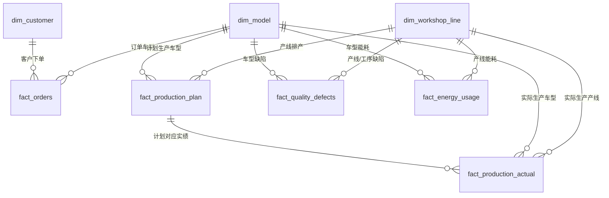
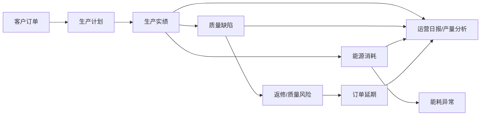

# 制造业运营态势 Chat BI 模拟数据集业务关系说明

## 一、业务对象关系

## 二、业务链路

## 三、预置业务异常

1. **质量异常**  
   2026 年 6 月，M003（中卡C型）在 L002（焊装一线）出现明显质量异常，主要集中在“焊装-焊点虚焊”。

2. **能耗异常**  
   2026 年 6 月 10 日至 6 月 24 日，L002（焊装一线）单车电耗明显高于前后时间段。

3. **订单延期**  
   2026 年 6 月，客户 C005 的 M003 订单集中延期，可结合 M003 质量缺陷和 L002 产线达成率下降进行分析。

4. **班次效率异常**  
   L003（总装二线）夜班生产达成率持续低于白班。

5. **停线异常**  
   2026 年 4 月 8 日至 4 月 18 日，L005（总装三线）停线时长偏高。

## 四、典型可问问题

- 2026 年 6 月各车型的总产量是多少？
- 2026 年 6 月哪个车型质量缺陷数量最多？
- M003 车型 6 月主要缺陷集中在哪个工序和缺陷类型？
- 2026 年 6 月 10 日至 6 月 24 日，哪条产线单车电耗异常升高？
- 客户 C005 在 6 月是否存在订单延期？主要涉及哪个车型？
- 客户 C005 订单延期可能与哪些生产或质量问题有关？
- 生成 2026 年 6 月运营日报，包含产量、质量、能耗和订单延期概览。
