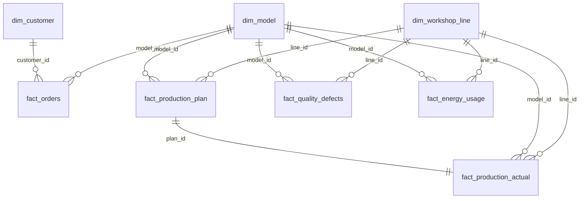

# 表关系说明

本数据集采用“维表 + 事实表 + 问题集”的结构。参赛团队可先导入维表和事实表，再根据字段关系构建查询层、语义层或数据仓库。

## 一、主外键关系

| 主表 | 主键 | 从表 | 外键 | 关系 |
|---|---|---|---|---|
| dim_customer | customer_id | fact_orders | customer_id | 一个客户可以有多笔订单 |
| dim_model | model_id | fact_orders | model_id | 一个车型可以对应多笔订单 |
| dim_model | model_id | fact_production_plan | model_id | 一个车型可以被多次排产 |
| dim_workshop_line | line_id | fact_production_plan | line_id | 一条产线可以有多条生产计划 |
| fact_production_plan | plan_id | fact_production_actual | plan_id | 一条生产计划对应一条生产实绩 |
| dim_model | model_id | fact_production_actual | model_id | 一个车型可以有多条生产实绩 |
| dim_workshop_line | line_id | fact_production_actual | line_id | 一条产线可以有多条生产实绩 |
| dim_model | model_id | fact_quality_defects | model_id | 一个车型可以有多条质量缺陷记录 |
| dim_workshop_line | line_id | fact_quality_defects | line_id | 一条产线可以有多条质量缺陷记录 |
| dim_model | model_id | fact_energy_usage | model_id | 一个车型可以有多条能耗记录 |
| dim_workshop_line | line_id | fact_energy_usage | line_id | 一条产线可以有多条能耗记录 |

## 二、业务分析关联

部分业务问题不是通过单一外键直接关联，而是通过“同车型 + 同时间窗口 + 同产线”等条件进行分析。

| 业务问题 | 建议关联方式 |
|---|---|
| 订单延期可能与哪些生产问题有关 | fact_orders.model_id = fact_production_actual.model_id，并按 planned_delivery_date 附近的 production_date 关联 |
| 订单延期可能与哪些质量问题有关 | fact_orders.model_id = fact_quality_defects.model_id，并按 planned_delivery_date 附近的 defect_date 关联 |
| 单车能耗是否异常 | fact_production_actual 与 fact_energy_usage 按 line_id、model_id、日期和班次关联 |
| 某车型质量缺陷率 | fact_quality_defects 按 model_id 汇总缺陷数量，再除以 fact_production_actual 中同车型产量 |
| 某产线生产效率 | fact_production_actual 按 line_id、shift 汇总 achievement_rate、downtime_minutes 和 actual_quantity |

## 三、关系图

